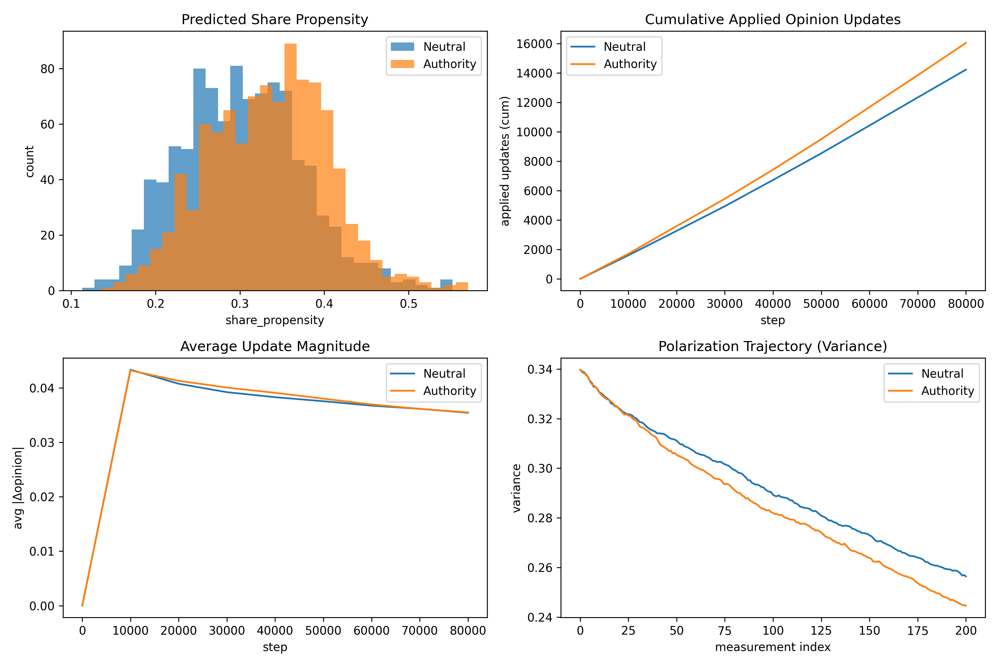

# Authority, Sharing, and Polarization  
**An Empirically Grounded Agent-Based Model of Opinion Dynamics**

---

## Overview

This project integrates **experimental evidence on authority framing** with an **agent-based model (ABM)** of opinion dynamics to examine whether *micro-level increases in sharing behavior* can translate into *macro-level polarization effects*.

The core contribution is **mechanism testing**: isolating *exposure amplification* as a causal channel and evaluating its consequences under standard bounded-confidence dynamics.

---

## Empirical Background (Micro-Level)

Experimental results from my MSc thesis show that:

> **Authority framing significantly increases individuals’ willingness to share false information.**

This effect has been independently re-validated on the cleaned experimental dataset using permutation tests and robust regression. The ABM does **not** re-estimate this effect; instead, it **takes it as given** and embeds it structurally.

---

## Research Question (Macro-Level)

> *Is increased information diffusion—driven solely by authority-induced sharing—sufficient to alter polarization outcomes when belief susceptibility is held constant?*

Crucially, this project also asks **when and why this mechanism may fail**.

---

## Conceptual Design

### Route A: Exposure Amplification (implemented here)

**Authority framing → higher sharing probability → higher exposure frequency**

- Authority affects **whether agents share**
- Opinion updating rules are **identical across conditions**
- No authority-based persuasion or influence boost is hard-coded
- Any macro differences arise *only* from exposure frequency

A separate extension (Route B), not used here, would allow authority to directly modulate influence strength or susceptibility.

---

## Model Description

### Opinion Dynamics
- Agent-based model on a social network
- Continuous opinions in \([-1, 1]\)
- Bounded-confidence updating
- Homophilic network rewiring
- Polarization measured as cross-sectional opinion variance

### Behavioral Integration
- Each agent is assigned a **share propensity**
- Share propensity is predicted by a neural network trained on **real experimental data**
- Inputs include authority context and individual traits
- The neural network **does not** affect opinion updating

---

## Identification Strategy

Neutral and Authority simulations share:
- the same network structure
- the same initial opinions
- the same agent traits
- the same random seed

**The authority-context flag is the sole experimental manipulation.**

---

## Simulation Parameters (This Run)

```json
{
  "n_agents": 200,
  "avg_degree": 8,
  "n_steps": 80000,
  "polarized_start": false,
  "mu": 0.3,
  "confidence_bound": 0.6,
  "repulsion_threshold": 0.9,
  "p_rewire": 0.002,
  "similarity_threshold": 0.4,
  "seed": 42,
  "use_nn": false
}
```

### Model switches
- Thesis share model (Route A): **ON**
- Influence NN for opinion updating (`use_nn`, Route B): **OFF**

---

## Learned Sharing Behavior  
*(Neural network output)*

| Condition | Mean | Std | Min | Max |
|----------|------:|----:|----:|----:|
| Neutral | 0.306 | 0.039 | 0.205 | 0.379 |
| Authority | 0.300 | 0.036 | 0.178 | 0.370 |

---

## Polarization Outcomes

- Neutral condition (start → end): **0.3172 → 0.0481**
- Authority condition (start → end): **0.3172 → 0.0331**

**End-of-simulation difference (Authority − Neutral): -0.0150**

---

## Results Visualization

The figure below summarizes the mechanism and outcomes (including the polarization trajectory as Panel D).



---

## Network Dynamics

### Authority condition — network evolution


---

## Interpretation (Route A)

This simulation demonstrates a boundary result:

Even when authority framing increases sharing at the individual level, exposure amplification alone may be insufficient to generate polarization under wide confidence bounds and symmetric updating rules.

The macro-level consequences of authority therefore depend on model regime, network structure, and potentially additional mechanisms such as asymmetric trust or authority-biased influence.

---

## Reproducibility

This README was **automatically generated** from the latest simulation run.

**Timestamp:** 2026-01-21 21:57 UTC

---

## Author

**Christos**  
MSc Behavioural Economics  
Computational Social Science & Agent-Based Modeling
